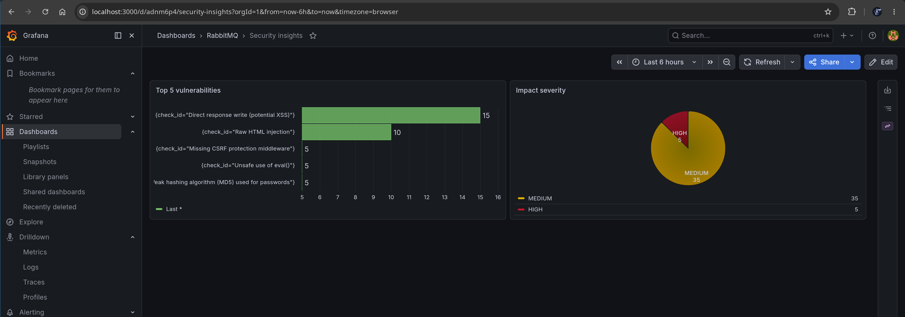
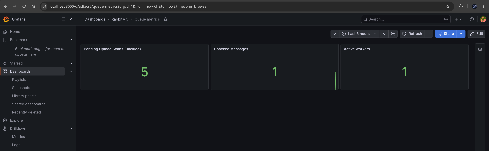

# SAST Scanner


An event-driven pipeline for static application security testing (SAST).


_(Grafana dashboard showing security data: top 5 vulnerabilities found and impact severity spread)_

## Features

* File upload: users can upload their projects in ZIP format which are stored in S3 like storage (Garage). The frontend is currently very simple (see future additions).
* Asynchronous scan jobs: workers pick up pending scans from a queue to scan them in the background at their own pace.
* Security scanning: workers unzip the projects and use Semgrep to identify findings.
* Persistence and observability: findings are stored in DB. Grafana dashboards are used for simple operation metrics and security insights. Prometheus and Loki are used to forward logs and expose metrics to Grafana.

_Note: this project is still in development. The current features are limited, see Future additions/known issues headings below._

## System design & stack

_High level diagram containing general components and system design._ 


### API
The main API is written in Python, specifically it is Django based. It allowed me to get off the ground quickly. It felt like a 'batteries included' experience. I also got some practise with Python which was a plus. There was also some great django packages available such as `django-outbox-pattern` that I used for the outbox pattern, it was super easy to implement.

### Workers & Scanning

The workers are Node.js based. To be honest the decision behind this was that originally I was going to focus purely on JS/TS projects and use the AST to identify potential issues. So Node.js was an obvious choice for my original plan. However, while developing I decided to use an out the box solution for scanning, one that would battle-tested and could support different projects not just JS. Because of that I went with Semgrep.

In the future I'd like to add additional security steps/checks to compliment semgrep, hoping to improve findings. So technically the worker does not need to be Node.js based anymore, it could easily be changed. My message broken choice allows me to make the workers tech agnostic, so if I needed a specific langauge or tool for step then the door is open.

### Message broker

I went with RabbitMQ as the choice here because its popular, has good support, its more than just a simple queue (beneficial for the future), and it allows me to have workers/consumers in different technologies/languages if needed. It's also quite fast to get up and running, no messing about with tons of configuration.

### Object storage

I wanted to be able to store the zip files easily and also run the store inside a container for local development purposes. Theres a few solutions out here to achieve that, I chose Garage because its open source and is S3 compatible - means we can use any S3 compitable store in production i.e. it doesn't need to be Garage. It also seemed to be actively maintained compared to some of the other solutions which are now archived.

## Getting started

All of the services are managed by docker compose, you will need to ensure that you have Docker installed. Of course you don't need to use docker, but it is recommended for simplicity. Once running you will need to run migrations and setup admin user.

### Migrations

You will need to run migrations before hand

```bash
docker compose exec api python manage.py migrate
```

You can verify/view migrations using the following command

```bash
docker compose exec api python manage.py showmigrations
```

For development: If you want to create a new migration, you can run the following after making changes to your model.

```bash
docker compose exec api python manage.py makemigrations
```

### Setting up Django admin user

Technically this is optional. However if you want access to the django admin panel which is useful for debugging and managing your data then you should follow this step.

```bash
docker compose exec api python manage.py createsuperuser
```

### Running with docker compose

You can start the stack up with the following

```bash
docker compose up
```

Alternatively, you can run watch mode which is beneficial for restarting containers when changes happen during development.

```bash
docker compose watch
```

### Uploading files

The frontend is extremely simple as it contains a single form for file uplods. You can visit it here: http://localhost:8000

There is no area in the frontend to see previous uploads or their statuses at the moment. This will be addressed later - see future additons heading below.

## Observability

I've created a couple of simple dashboards in Grafana; one for RabbitMQ metrics (operations) and security threats/insights (top vulnerabilities found etc). They should be living under `./monitoring/json` and added to Grafana upon starting up.


_(Grafana dashboard showing rabbitmq metrics from prometheus)_


_(Grafana dashboard showing security data: top 5 vulnerabilities found and impact severity spread)_

## Debugging

Here are some useful links for debugging in development. 

| Component  | Link | Notes |
| ------------- | ------------- | ------------- |
| Grafana  | http://localhost:3000/  | Contains rabbitmq metrics and security dashboard. Login is `admin:pass` |
| Prometheus  | http://localhost:9090/targets | Query metrics in prometheus - useful for debugging |
| RabbitMQ management  | http://localhost:15672 | UI for managing an viewing queues, exchanges etc. Login is `guest:guest` |
| Django admin | http://localhost:8000/admin | Can show/manage data from your chosen models; zip uploads and scan findings |
| Bucket debug | http://localhost:8000/debug | Django endpoint that returns buckets and items in JSON |

Useful garage (object storage) commands if the bucket debug endpoint doesn't help. You can also look at garage help command for more.

```bash
docker compose exec object-store /garage bucket list
docker compose exec object-store /garage bucket info pending-bucket
```

## Development

As mentioned above its recommended to use `docker compose watch`. You should follow the prequisuites above in 'Getting started' if you haven't already before continuing.

If you make changes to the Dockerfiles you may need to rebuild your containers `docker compose up --build`.

### Saving Dashboards

When creating a dashboard in Grafana it won't persist on container stop/start. To persist you can export the dashboard as code and save into this repo under the following directory `./monitoring/json`.

Note: sometimes if you restart and try to re-edit the dashboard the UI won't let you. If this occurs you can edit from the file. Or you could backup the file then re-import it. Not ideal, but I haven't found an easier way around it yet.

### Linter & formatting

Currently there is only a linter/formatter for the Python API. Here are some useful commands on how to get started with it

```bash
# identify lint issues but don't apply fix
ruff check .
# identify lint issues and apply fix
ruff check --fix .
# apply formatting based off set rules
ruff format .
```

Ruff can be configured with specific rules but I've just left it with default settings as they seemed sensible to start off with.

## Todos
Tasks next in line before i move to `Future additions/known issues`.

- Add idempotency check, unique file names - look at redis
- Add lifecycle policy for pending bucket to clean up zips. Also move to processed bucket.
- Data validation lib?
- Capture line locations for a finding - atm its just identifies if check is in a project and the file its present in
- On file upload avoid file overwriting if chance of name/UUID clash (take into account race conditions)
- Improve error handling incl. DLQ delayed retries

## Future additions/known issues
- Add scan project cleanup code
- Replace console.log with more robust solution (pino logger?)
- Improve logging with tracing/correlation etc
- Expand semgrep error handling (semgrep returns errors array) 
- Improve security checks:
  - Run scan inside secure sandbox rather than worker - need to explore/research this
  - ZIP path traversal
  - Symbolic link concerns?
- Expand observability e.g. add average scan times to grafana 
- Make findings/checks configurable - they are hardcoded
- Add auth so user's can login and manage their own uploads. Frontend should show pending uploads with status (polling?).

## Useful resources/docs
* Django styleguide/conventions: https://github.com/HackSoftware/Django-Styleguide
* Outbox in django: https://github.com/juntossomosmais/django-outbox-pattern
* Manually oublish event (as opposed to decorator): https://github.com/juntossomosmais/django-outbox-pattern#publish-message-via-outbox
* Node RabbitMQ: https://www.rabbitmq.com/tutorials/tutorial-one-javascript
