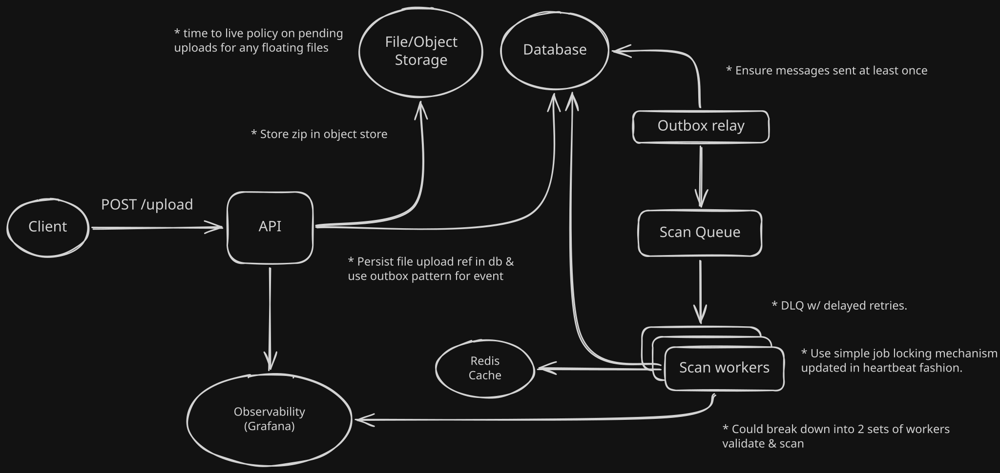

# SAST Scan project

A simple automated security analysis tool for scanning JavaScript projects.



Notes

```
## Activate virtual env
source .venv/bin/activate

## Run api in dev
python manage.py runserver

## Migrations
docker compose exec api python manage.py showmigrations
docker compose exec api python manage.py makemigrations
docker compose exec api python manage.py migrate

## Create admin user
docker compose exec api python manage.py createsuperuser

## Cool garage commands
docker compose exec object-store /garage bucket list
docker compose exec object-store /garage bucket info pending-bucket

## RabbitMQ management UI
http://localhost:15672/queue/ (guest:guest)
```

## Todos
- Publish message only on create? (not update too) - https://github.com/juntossomosmais/django-outbox-pattern#publish-message-via-outbox
- Linter
- Add lifecycle policy for pending bucket to clean up zips
- Data validation lib?
- Capture file and line locations for a finding - atm its just identifies if check is in a project
- On file upload avoid file overwriting if chance of name/UUID clash (take into account race conditions)
- Proper logging and setup Grafana (metrics, tracing etc)
- Add visibility/monitoring for outbox relay and workers

## Future additions
- Support TypeScript projects
- Make findings/checks configurable - they are hardcoded

## Useful resources/docs
* Django styleguide/conventions: https://github.com/HackSoftware/Django-Styleguide
* Outbox in django: https://github.com/juntossomosmais/django-outbox-pattern
* Node RabbitMQ: https://www.rabbitmq.com/tutorials/tutorial-one-javascript
